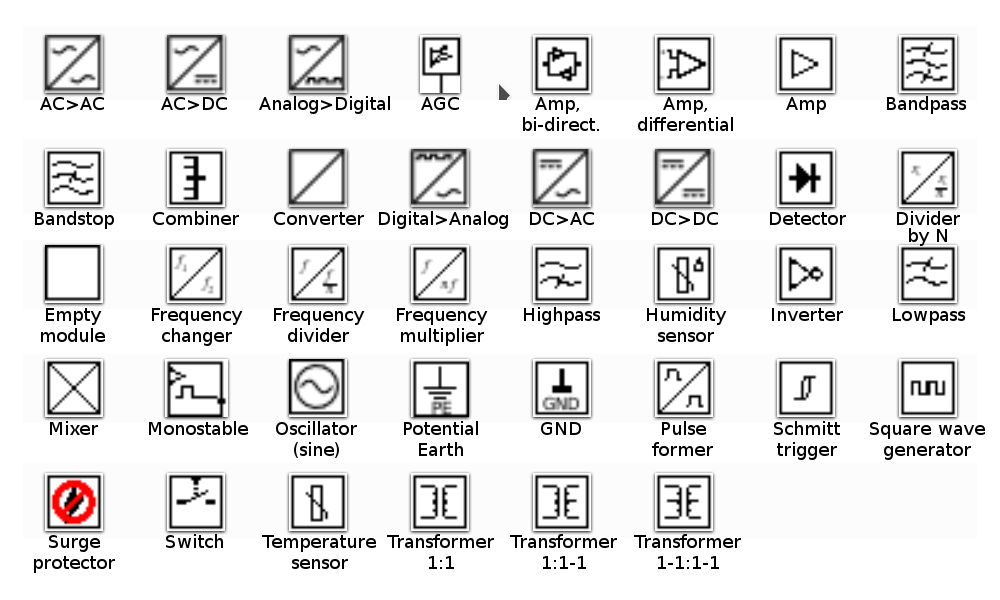

Electronic block shapes for [Dia](http://dia-installer.de). To install, 

  * Create a directory `.dia` in your home directory (i.e. `~/.dia`), if it doesn't already exist.
  * Copy the directories `shapes` and `sheets` to your `~/.dia` directory. 
  * (Re)start Dia.
  
Now you can find the shapes in the list of sheets, as `Electronics_Blocks`. Works with Dia, v. 0.97

